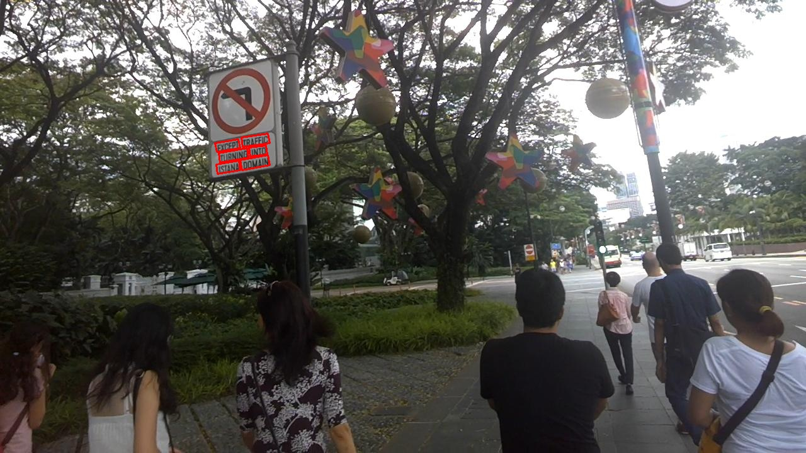

# Psenet_v2
The code is based on resnet50. At present, the data set hmean in icdar2015 is about 80. A rough version will be sorted out and optimized later.

## 使用方式和psenet一毛一样，比较粗糙，希望大家一起交流，目前只能train到80左右，test实现方式和论文有点出入

### example

# reference

https://github.com/whai362/PSENet

